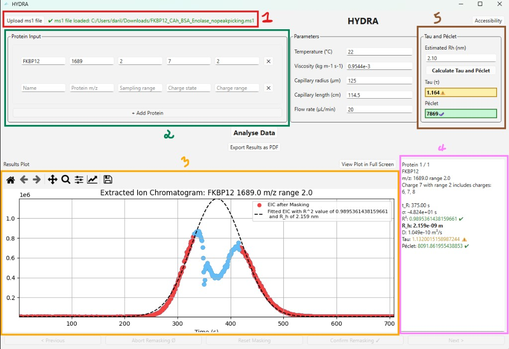
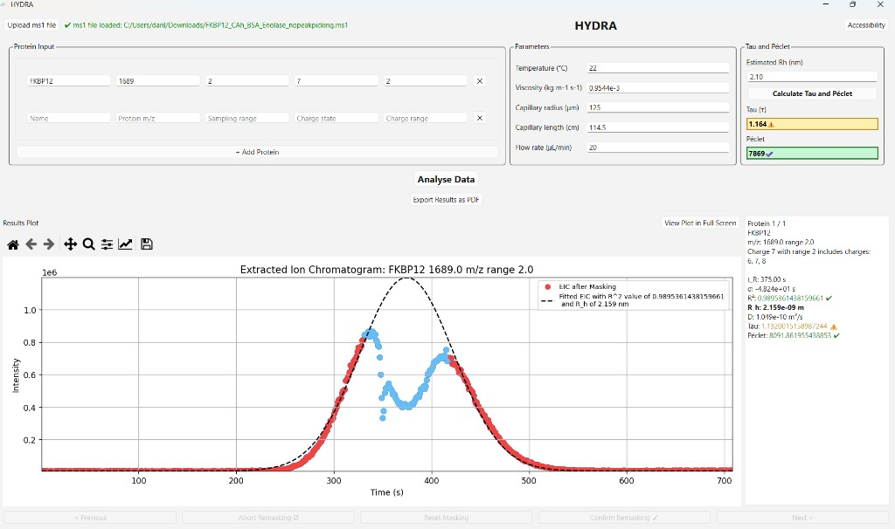
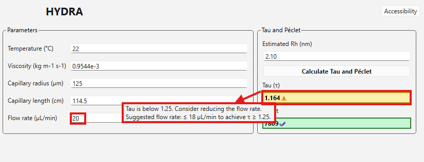
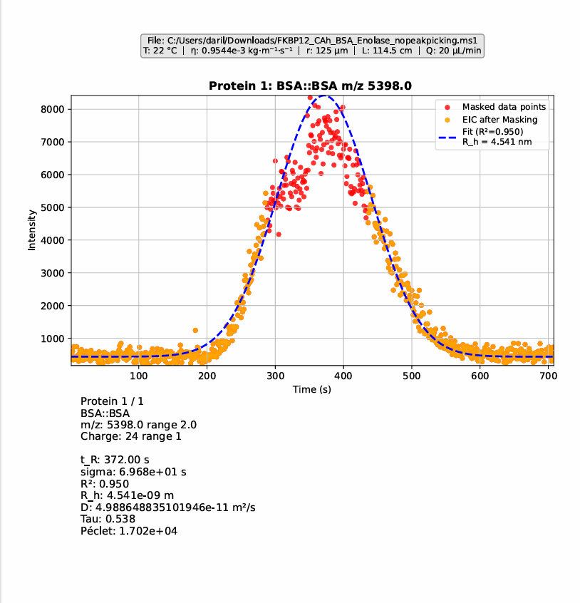

# HYDRA User Guide (for Chemists)

This guide is written for lab users who do not code. It explains how to run HYDRA, what each input means, and how to read the results.

## What You Need
- A Windows PC with HYDRA installed.
- An `.ms1` file exported from your mass spectrometer.

## Quick Start (2–3 Minutes)
1. Open HYDRA.
2. Click **Upload ms1 file** and select your `.ms1`.
3. Fill one protein row (name, m/z, sampling range, charge state, charge range).
4. Confirm **Parameters** (temperature, viscosity, capillary radius/length, flow rate).
5. Click **Analyse Data**.
6. Review the plot and results panel.
7. Optional: remask points and **Confirm Remasking**.
8. Click **Export Results as PDF**.

## Main Screen Overview

## Features
1. Load MS1 files and parse spectra
2. Extract EICs for one or many proteins across charge ranges
3. Automatic peak masking and Gaussian fit
4. Quality metrics (R2, tau, Peclet) with visual indicators
5. Calculate tau and peclet given an estimated Rh

## Step-by-Step Workflow

### 1) Load MS1 data
Click **Upload ms1 file** and choose your `.ms1` file. The status text turns green when the file is loaded.

### 2) Add protein inputs
Each protein row describes one protein to analyze.
- **Name**: your label (example: FKBP12).
- **Protein m/z**: target mass-over-charge value.
- **Sampling range**: window around the target m/z.  
  Example: m/z 1689 with range 2.0 means 1687–1691.
- **Charge state**: expected charge (z).
- **Charge range**: how many charge states around the expected one to include.  
  Example: charge 7, range 2 includes charges 5–9.

Use **+ Add Protein** to analyze multiple proteins in one run.

### 3) Set physical parameters
These are used for diffusion and hydrodynamic radius calculations.
- **Temperature (C)**
- **Viscosity (kg m-1 s-1)**
- **Capillary radius (um)**
- **Capillary length (cm)**
- **Flow rate (uL/min)**

Use your experimental values. Defaults are common lab settings.

### 4) Optional: Calculate Tau and Peclet
Enter **Estimated Rh (nm)** and click **Calculate Tau and Peclet** for a quick check.  
This does not run the full analysis.

### 5) Run analysis
Click **Analyse Data**. The app:
- extracts the EIC,
- masks noisy dips,
- fits a Gaussian,
- computes R2, t_R, sigma, D, Rh, tau, and Peclet.

### 6) Review results
You will see:
- a plot with raw points, masked points, and the fitted curve,
- a results panel with numeric values and color indicators.

## 6.2) Do you get a bad Tau value? Ajust the flow rate Q!! ("Just hover the mouse over the Tau value field." )

### 7) Remask if needed
If the fit looks wrong, you can remask points:
1. Select points to exclude on the plot.
2. Click **Confirm Remasking** to recalculate.
3. Use **Abort Remasking** to cancel.

### 8) Export to PDF
Click **Export Results as PDF** to save a report.

## Understanding the Output
- **t_R**: retention/peak time (seconds).
- **sigma**: peak width.
- **R2**: fit quality (closer to 1 is better).
- **D**: diffusion coefficient.
- **Rh**: hydrodynamic radius.
- **tau / Peclet**: flow/transport measures.

Green indicators mean good quality. Yellow or red suggests re-checking inputs or remasking.

## Common Errors
**“No ms1 file loaded”**  
Load an `.ms1` file before analysis.

**Input error pop-ups**  
A value is not numeric or out of range. Correct the input and retry.

## Tips
- Start with one protein to verify settings.
- Use a small sampling range first, then widen if signal is weak.
- If R2 is low, try remasking.

## File Format Notes (MS1)
HYDRA reads plain-text `.ms1` files with scan blocks. If loading fails, confirm the file is not compressed and follows the MS1 format.
